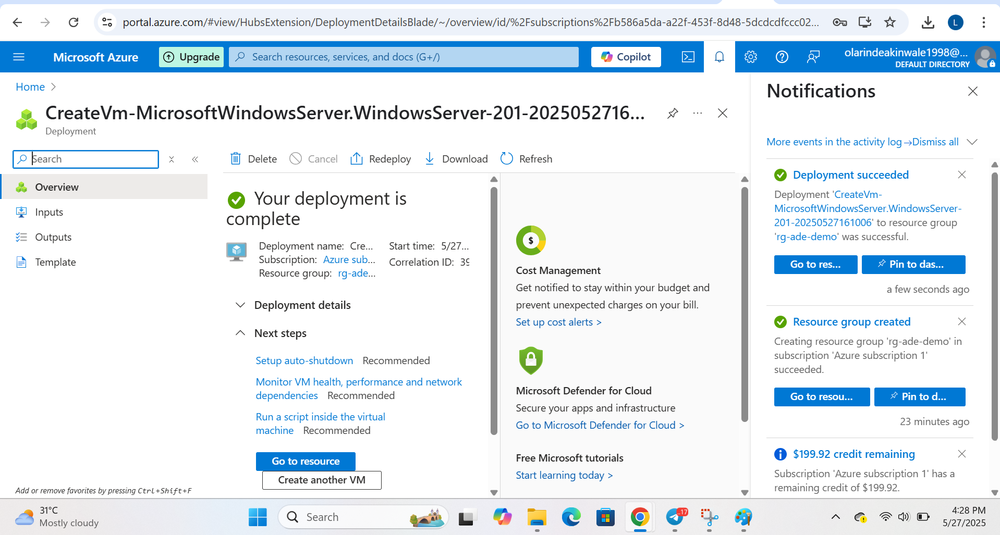
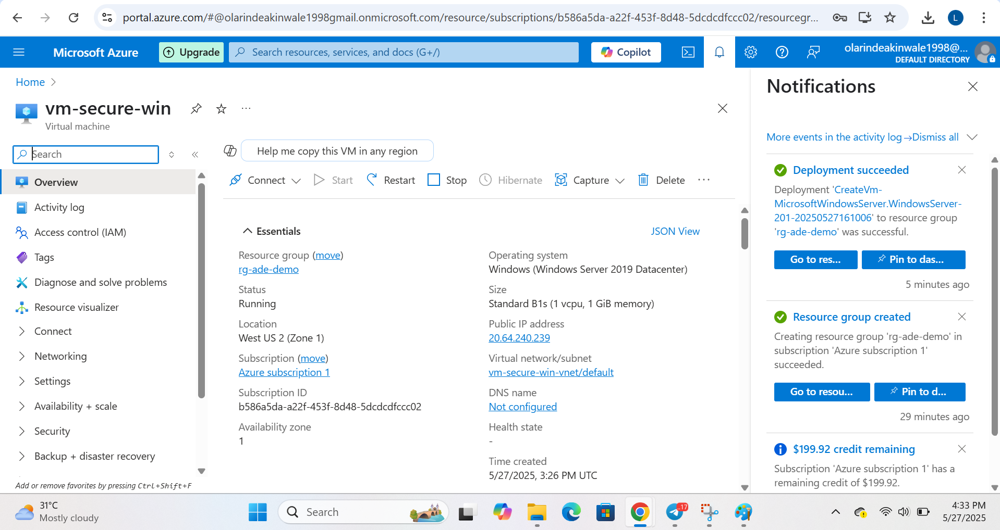
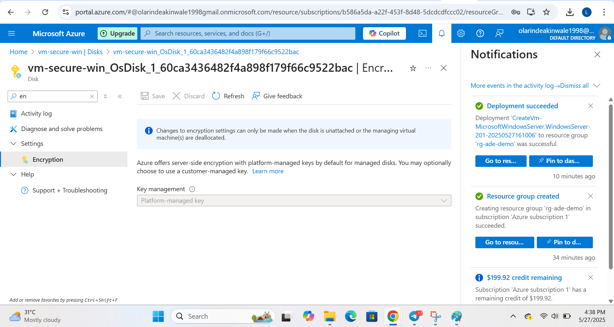
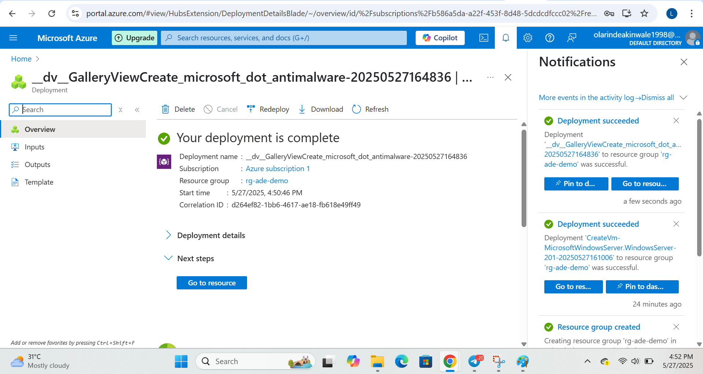
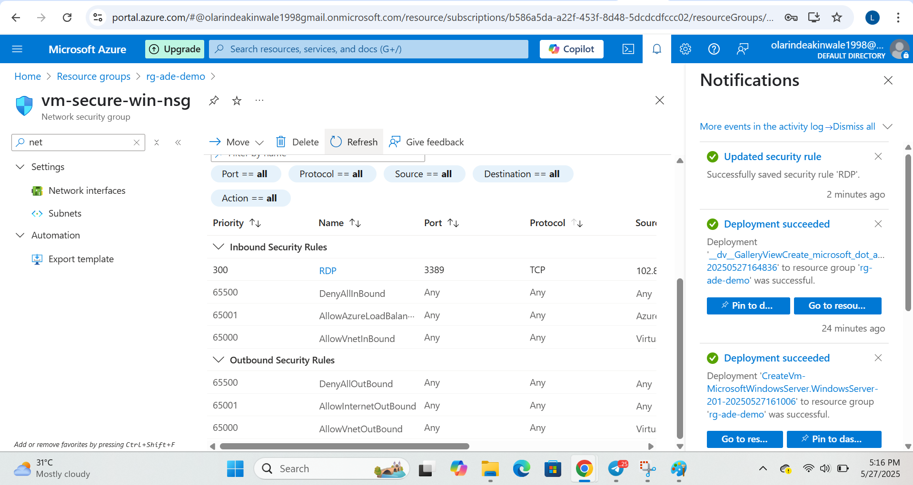
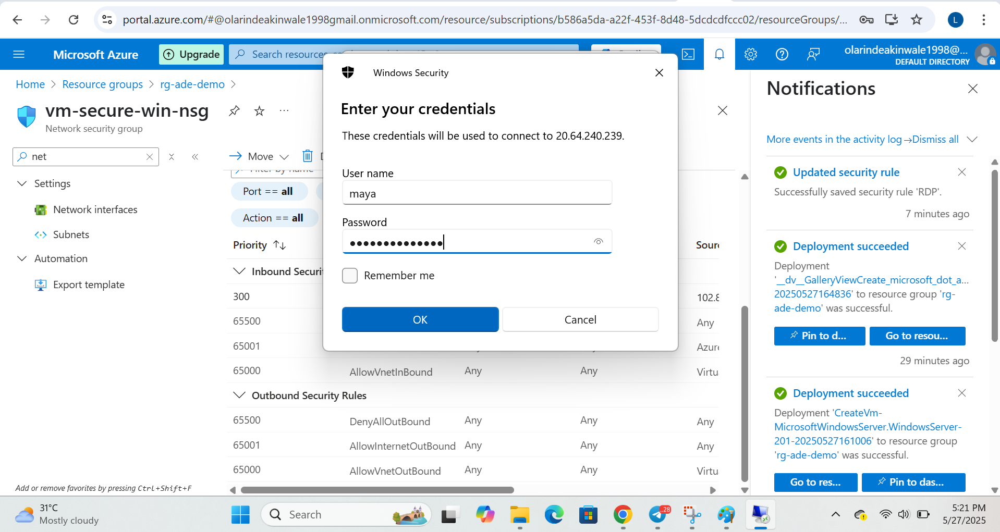
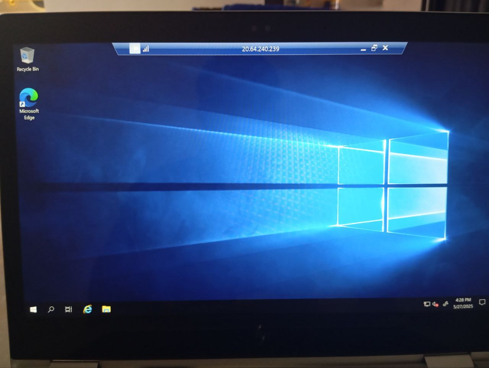

# Secure VM Deployment and Remote Access (RDP)

This project demonstrates how to deploy a secure Windows virtual machine (VM) on Microsoft Azure and enable remote access using Remote Desktop Protocol (RDP). The deployment includes VM configuration, disk encryption, security group rules, and antimalware extension.

---

## Real-Life Scenario

A mid-sized company needs to deploy a Windows Server virtual machine in Azure to host internal tools used by its remote staff. For security and compliance reasons, the IT team must:

- Lock down the VM so only authorized ports like RDP (3389) are open.
- Ensure all data is encrypted at rest.
- Prevent malware threats by enabling security extensions.
- Control remote access using just-in-time RDP configuration.

As a Cloud Security Engineer, you are tasked with creating this virtual machine with the correct network rules, encryption settings, and access configurations. This project simulates that exact setup.

---

## Key Takeaways

- NSGs act like a virtual firewall to control traffic to/from Azure resources.
- Allowing only required ports (like 3389 for RDP) follows the principle of least privilege.
- Platform-managed encryption ensures baseline data security.
- Successful RDP login confirms the entire VM setup works end-to-end.

---

## Screenshots Included

### 1. VM Creation Started

### 2. VM Successfully Created

### 3. Disk Encryption Enabled

### 4. Antimalware Extension Deployed

### 5. NSG Rule for RDP Configured

### 6. RDP Client Prompted for Connection

### 7. RDP Session Successful

---

## Author

Olarinde Akinwale – Cloud Security Engineer in training
