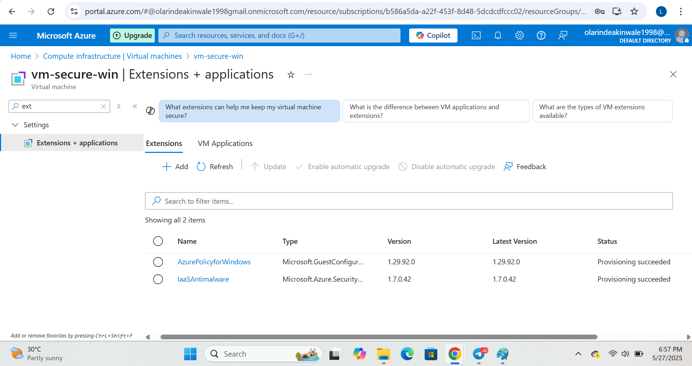
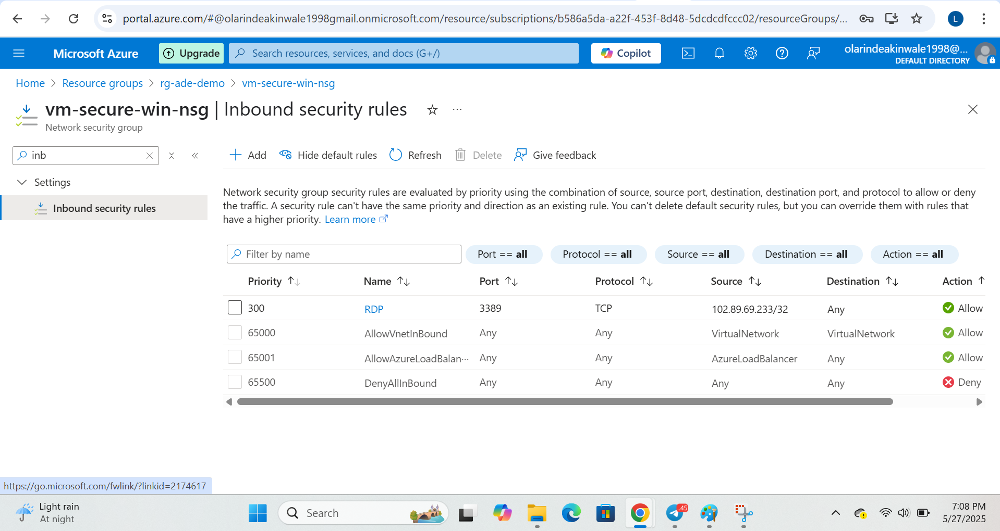

# Secure Azure VM Deployment with Restricted RDP Access

This project walks you through how I deployed a secure Windows Virtual Machine (VM) on Microsoft Azure and locked down remote access to it. The goal was simple: build a VM that’s not only protected with encryption and antimalware—but also ensures that only one trusted IP can connect via Remote Desktop (RDP).

---

## Real-Life Scenario

Think of this like setting up a remote office computer that only your team lead can log into—and only from their home network. No one else should even get close. That’s exactly what I recreated here using Azure’s security features.

---

## What This Project Covers

- Deployed a Windows Server VM on Azure  
- Encrypted the VM’s OS disk using platform-managed keys  
- Installed and configured Microsoft Antimalware for real-time protection  
- Created strict NSG (firewall) rules to allow RDP access from one specific IP  
- Blocked RDP attempts from all other IPs  
- Tested both successful and failed connection scenarios

---

## Tools & Services Used

- Microsoft Azure  
- Azure Virtual Machine (Windows Server 2019)  
- Azure Disk Encryption  
- Microsoft Antimalware Extension  
- Azure Network Security Group (NSG)  
- Remote Desktop Protocol (RDP)  

---

## How It Went – Step-by-Step

1. Created the VM – Named it vm-secure-win, chose B1s size (free tier), and added admin credentials  
2. Enabled Disk Encryption – To ensure stored data is safe  
3. Added Antimalware Extension – With real-time protection and quick scan enabled  
4. Configured NSG Rules – Opened port 3389 (RDP) for just one IP (mine)  
5. Tested It – Connected successfully from my IP; failed from everywhere else (as expected!)

---

## Testing Scenarios

1. Access Granted – RDP from my whitelisted IP worked perfectly  
2. Access Denied – Tried connecting from another network—it got blocked, just as planned  

---

## Screenshots

| Step | Description |
|------|-------------|
|## Screenshots

### 1. VM Deployment Started

### 2. VM Created Confirmation

### 3. Disk Encryption Enabled

### 4. Antimalware Extension Deployed

### 5. RDP NSG Rule Configured

### 6. RDP Client Connection Attempt

### 7. RDP Session Success

### 8. Antimalware Status Confirmed

### 9. NSG RDP Rule Final

### 10. Final RDP Login Confirmation

---

## About Me

Olarinde Akinwale  
Aspiring Cloud Security Engineer, practicing real-world Azure security tasks one project at a time.

---
